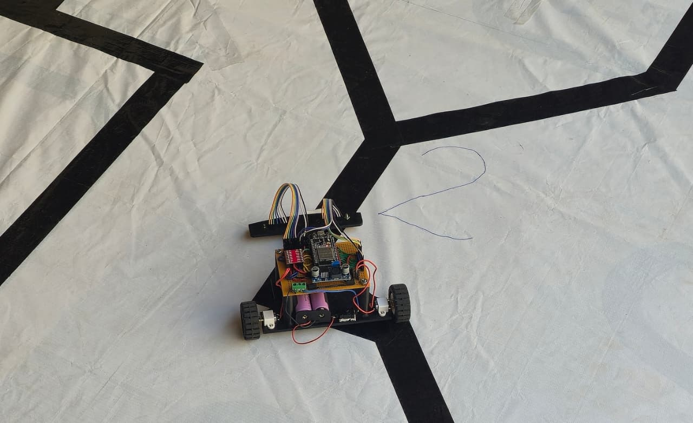
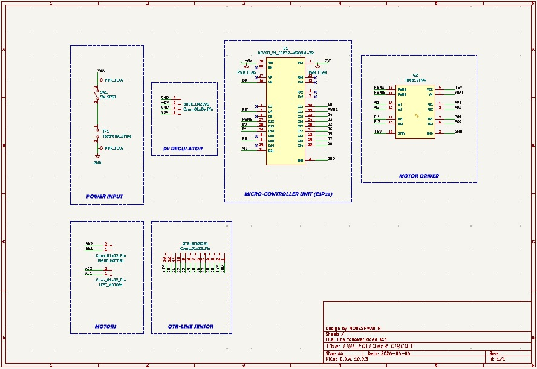
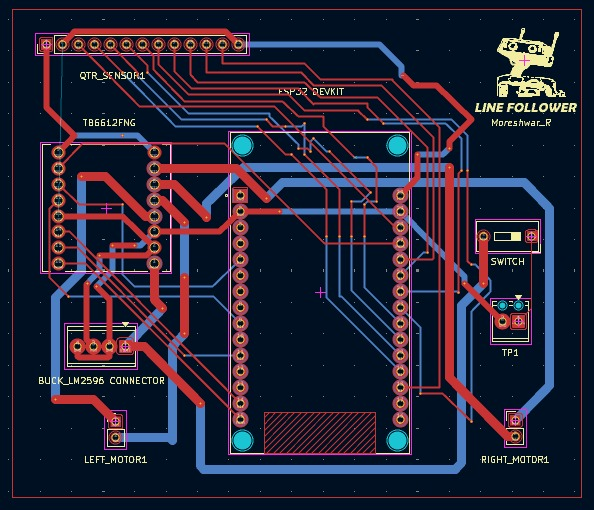
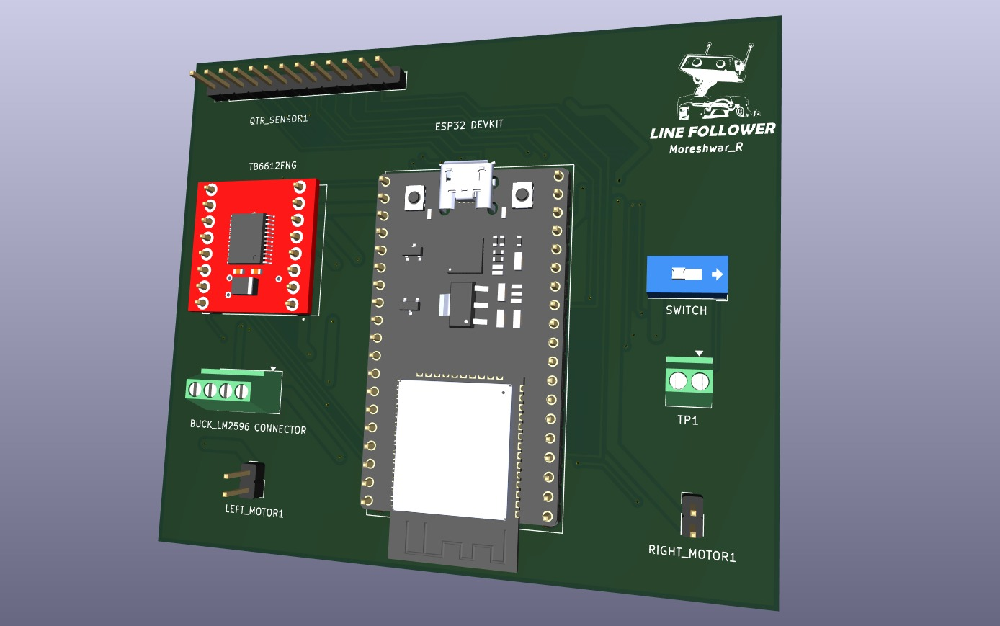

# 🏁 VECTRA — Line Follower Robot

**ESP32 · TB6612FNG · 10-channel IR array · LSRB intersection logic + Anti-Wobble PID**

VECTRA is a high-speed competition line follower designed to stay locked on the track even when the layout changes from one event to the next. A wide 10-channel IR array reads sharp turns, acute angles and intersections, while decisive LSRB logic layered over a tuned PID controller keeps every junction predictable. Built around an ESP32 and a TB6612FNG driver, it balances speed, stability and fast trackside tuning.

 

---

## ✨ Features

- **Wide 10-sensor coverage** — handles different track layouts without re-wiring.
- **LSRB intersection logic** — Left > Straight > Right priority at junctions.
- **Anti-wobble PID** — dead-band stops shivering on straights, saving time.
- **Line-lost recovery** — remembers last turn direction and sweeps back to the line.
- **Efficient drive** — TB6612FNG H-bridge with N20 micro-gear motors.

---

## 🧩 Components

| Component | Qty | Description |
|-----------|:---:|-------------|
| ESP32 DevKit (30-pin) | 1 | Dual-core microcontroller — reads the sensors and runs the control loop. |
| TB6612FNG motor driver | 1 | Dual H-bridge that drives both motors efficiently and cool. |
| N20 6V micro-gear motor + wheel | 2 | Provides drive; compact and quick. |
| Front caster wheel | 1 | Third contact point for smooth balance. |
| 10-channel reflective IR array | 1 | Senses the line; wide span covers changing track maps. |
| LM2596 buck module | 1 | Steps the 7.4 V battery down to a clean 5 V for the logic. |
| 2S Li-ion battery (7.4 V) | 1 | Main power source. |
| SPST switch | 1 | Master power cut-off. |
| Chassis, standoffs, wires, connectors | — | Frame and interconnections. |

---

## ⚙️ How It Works

1. **Read** the IR array and compute a weighted line `error` (outer sensors pull harder).
2. **Intersections / acute turns (LSRB):** left has priority, straight beats right, sharp turns snap.
3. **Line lost:** spin toward the last known turn until the line is reacquired.
4. **PID steering:** `correction = Kp·error + Kd·(error − lastError)`, applied differentially.

---

## 🛠️ Hardware Design

**Schematic**

 

**PCB Layout**

 

**3D Model**

---

## 💾 Firmware & Tuning

- Sketch → [`firmware/line_follower.ino`](firmware/line_follower.ino)
- Board: **ESP32 Dev Module** · Library: **QTRSensors**

| Variable | Default | Role |
|----------|:------:|------|
| `Kp` | 15 | Correction strength |
| `Kd` | 30000 | Damping / overshoot control |
| `baseSpeed` | 250 | Cruise speed (0–255) |
| `THRESHOLD` | 4090 | Black/white cutoff (recalibrate per track) |

---

## 📜 License

- Released under the **MIT License** — see [`LICENSE`](LICENSE).
- Free to use, fork and race.

---

## 🏷️ Topics

`#LineFollower` `#ESP32` `#TB6612FNG` `#PID` `#LSRB` `#Robotics` `#Arduino` `#Embedded` `#KiCad`
